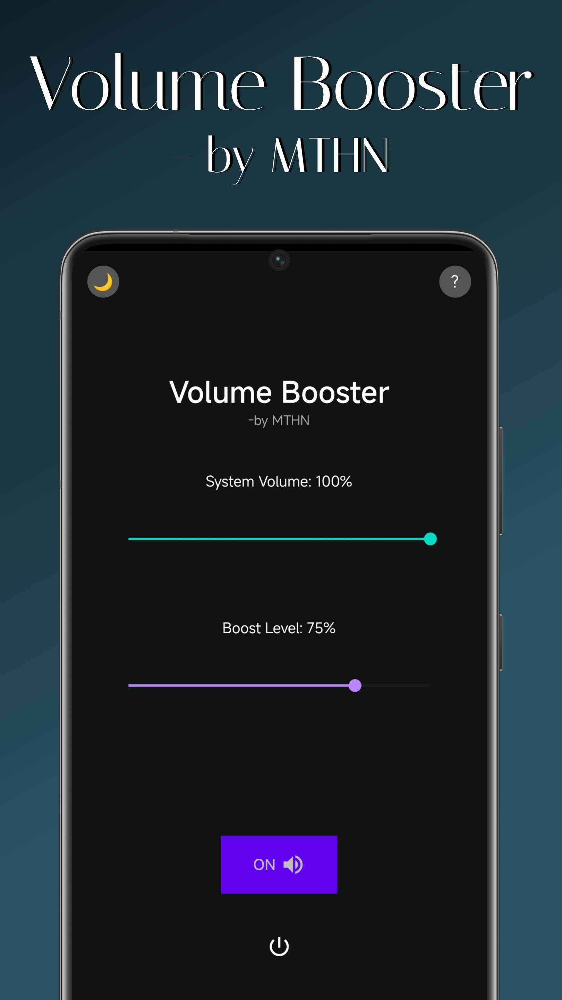

## Volume Booster – React Native Android app



This repository contains an open‑source volume booster application for Android devices, built with React Native and native Android modules. It allows you to increase the perceived audio output beyond the default system limits (use with extreme caution).

### Features

- **Boosted output**: Adjust the boost level from 0% to 200% using a dedicated slider.
- **System volume control**: View and change the system media volume directly from the app.
- **Quick Settings tile**: Toggle the booster on/off from the Android Quick Settings panel.
- **Home screen widget**: Simple widget to quickly toggle the booster without opening the app.
- **Safety warning**: Visual (red slider) and textual warnings when the boost exceeds a safe threshold.
- **Dynamic theme**: UI automatically adapts to light/dark mode.

### Tech stack

- React Native
- TypeScript
- Kotlin (native Android modules)
- Java (native Android modules)
- Android APIs: `LoudnessEnhancer`, `AudioManager`, `Service`, `BroadcastReceiver`, `ContentObserver`, `AppWidget`, `TileService`
- `@react-native-community/slider`

### Safety note

Boosting audio volume to high levels can cause **permanent hearing damage** and may damage your device’s speakers. Use this app at your own risk. Levels above ~75% should be considered unsafe for prolonged listening.

## Installation & development

### Requirements

- Node.js (>= 18)
- **Java JDK 17** — the Android build uses Gradle 8.x, which supports up to JDK 21. **JDK 24+ (e.g. JDK 25) is not supported** and will cause `Unsupported class file major version 69`. Use JDK 17 (or 21) and set `JAVA_HOME` accordingly if you have multiple JDKs installed.
- Android Studio / Android SDK (platform tools, build tools, at least one Android platform image)

### Install dependencies

```bash
npm install
```

### Run in debug (Android)

```bash
npx react-native run-android
```

An Android emulator or a USB‑connected physical device with USB debugging enabled is required.

## Building a release APK locally

This project is designed so that **no signing keys or passwords are stored in the repository**. To build your own signed release APK:

1. Generate your own release keystore (example):

```bash
keytool -genkeypair -v -storetype JKS -keystore my-release-key.keystore -alias my-key-alias -keyalg RSA -keysize 2048 -validity 10000
```

2. Add the following properties to `android/gradle.properties` (do **not** commit real values to Git):

```properties
MYAPP_RELEASE_STORE_FILE=my-release-key.keystore
MYAPP_RELEASE_KEY_ALIAS=my-key-alias
MYAPP_RELEASE_STORE_PASSWORD=YOUR_PASSWORD
MYAPP_RELEASE_KEY_PASSWORD=YOUR_PASSWORD
```

3. Place `my-release-key.keystore` under `android/app/` (or update the path in `MYAPP_RELEASE_STORE_FILE` accordingly).

4. Build the release APK:

```bash
cd android
./gradlew assembleRelease
```

The generated APK will be located under `android/app/build/outputs/apk/release/`.

## Privacy

The open‑source version of this app is designed to be privacy‑respecting:

- No advertising SDKs.
- No analytics or tracking libraries.
- No remote telemetry; all processing stays on the device.

Audio processing is performed locally using standard Android APIs.

## Android compatibility

- **Min SDK**: 24 (Android 7.0 Nougat)  
- **Target SDK / Compile SDK**: 34 (Android 14). The app is built and tested for Android 7 through 14; **Android 15+ is not supported** (see below).

### LoudnessEnhancer and session 0

This app uses Android’s `LoudnessEnhancer` with **audio session ID 0**, which attaches the effect to the **global output mix** (all playback). Important caveats:

- **Session 0 is deprecated.** Google has deprecated attaching `AudioEffect` (including `LoudnessEnhancer`) to session 0, citing too many problems with global effects. The recommended approach is to attach to a specific `AudioTrack` or `MediaPlayer` session instead, which this app does not do so that it can boost all device audio.
- **Android 15 (API 35) and AIDL effects.** On Android 15, many devices use the new AIDL-based audio effects implementation. On those devices, **`LoudnessEnhancer(0)` may not work, may be ignored, or may throw.** For this reason the app **targets API 34 (Android 14)** and does not support Android 15 and above.
- **Device and OEM variance.** Even on Android 7–14, some OEMs clamp gain, ignore the effect, or disable it for certain outputs. Perceived boost can vary or be absent on some devices.

**Supported range:** Android 7.0 (API 24) through Android 14 (API 34). Android 15+ is out of scope and may install but the boost is expected to be missing or unreliable. The app has been tested on **Android 12** (API 31).

### Other requirements

- Quick Settings tile: Android 7.0+ (API 24+).
- Notification permission is requested explicitly on Android 13+ (API 33+).

## Contributing

Contributions, bug reports and feature requests are welcome. For larger changes, please open an issue first to discuss what you would like to change.

When submitting a pull request:

- Keep code and comments in English.
- Follow the existing code style and linting rules.
- Avoid adding secrets, keystores or machine‑specific paths to the repository.

## Author

Metehan Öztürk – [metehanozturk.com.tr](https://metehanozturk.com.tr)

## License

This project is licensed under the MIT License. See the `LICENSE` file for details.
